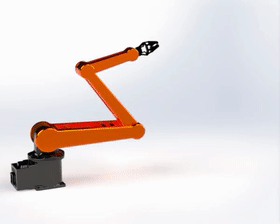

# Formation_MRSs_Cascade_Systems_Coupled_PT_Control
## Basic Information

>***Title :***
>> Formation Control of Multi-robot Systems Based on Cascade Systems Designed with Coupled Preset Time Control Units
>
>***Authors :***
>> Xinru Ma, Hengyu Li

## Figures
> 1. 您可以根据您的具体需求和论文的结构进行修改和扩展。该模板提供了一个基本的框架，可以帮助您在GitHub上以清晰和结构化的方式介绍您的论文。

## Videos 
> 1. 您可以根据您的具体需求和论文的结构进行修改和扩展。该模板提供了一个基本的框架，可以帮助您在GitHub上以清晰和结构化的方式介绍您的论文。

<video src="https://github.com/maxruu/Formation_MRSs_Cascade_Systems_Coupled_PT_Control/assets/99390180/444f5524-a328-4411-bfb7-f26ce0a451aa" width="100" height="50" controls></video>

