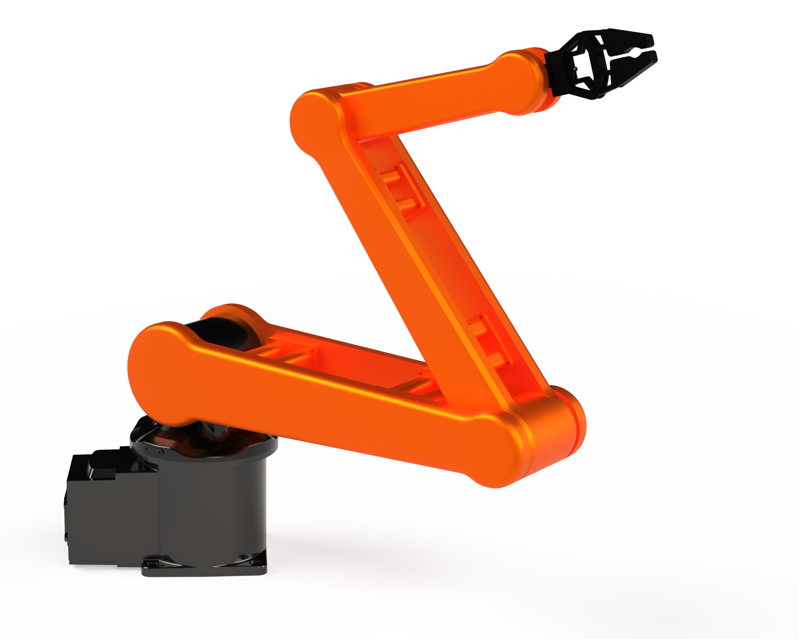

# Adaptive_Formation_MRSs_Coupled_PT_Control
## Basic Information

>***Title :***
>> Adaptive Formation MRSs Coupled PT Control
>
>***Authors :***
>> Xinru Ma, Hengyu Li

## Figures
> 1. Robot model: 3-link space robot based on 3-axis rotation.
<!--

-->

## Videos 
<!-- 
  
<video src="https://github.com/maxruu/Formation_MRSs_Cascade_Systems_Coupled_PT_Control/assets/99390180/444f5524-a328-4411-bfb7-f26ce0a451aa" width="100" height="50" controls></video>

-->

> 1. Evolution of completing time-varying formation ${\boldsymbol h}_{1}(t)$ in preset times.

<!-- https://github.com/maxruu/Formation_MRSs_Cascade_Systems_Coupled_PT_Control/assets/99390180/7f5569e6-0599-4ce0-b410-ee298de8bb79 -->

> 2. Evolution of completing task of formation  ${\boldsymbol h}_{2}$ along path $g(t)$ in preset times.

<!-- https://github.com/maxruu/Formation_MRSs_Cascade_Systems_Coupled_PT_Control/assets/99390180/80004e1f-41bc-4959-86e2-aad2ef23c621 -->

